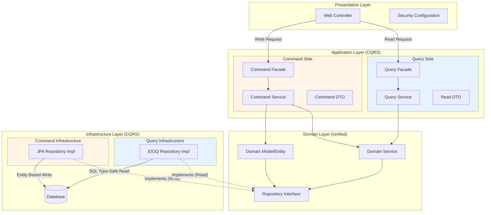
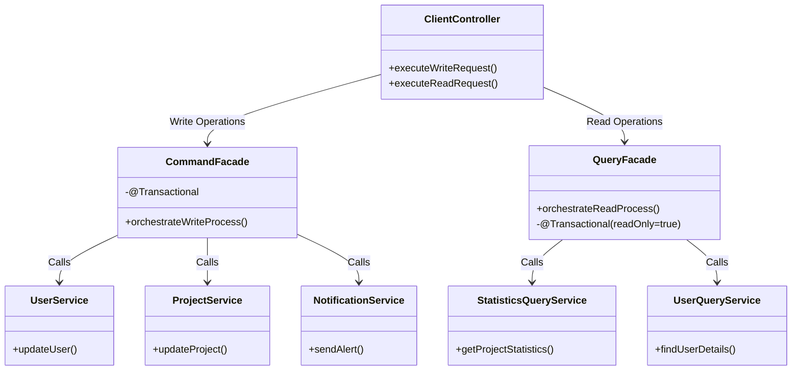
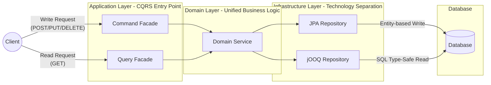
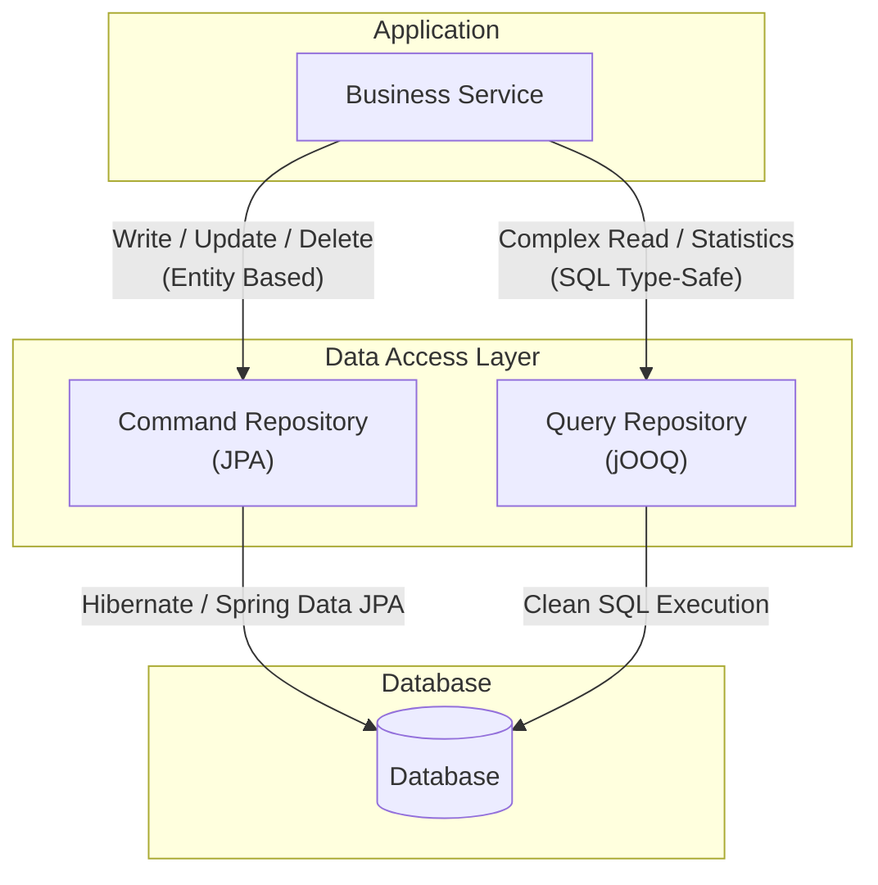

# PKNU CERT IS - Backend

## Backend Architecture Structure

본 프로젝트의 백엔드는 복잡한 비즈니스 로직을 효율적으로 처리하고, 유지보수성과 확장성을 확보하기 위해 다음과 같은 아키텍처 설계를 적용했습니다.

### Key Architectural Concepts

**Clean Architecture & Partial DDD**
   - 비즈니스 로직(Domain/Application)을 프레임워크나 데이터베이스(Infrastructure)로부터 분리하여 독립성을 보장합니다.
   - **Partial DDD (부분적 도메인 주도 설계)**: 도메인 엔티티 내에 비즈니스 로직을 응집시키는 DDD의 전술적 패턴을 일부 도입하여, 서비스 계층이 비대해지는 것을 방지하고 객체지향적인 설계를 지향했습니다.

**2. Facade Pattern with CQRS (Command Query Responsibility Segregation)**
   - 애플리케이션 계층의 진입점으로 Command/Query Facade를 각각 두어, 복잡한 하위 서비스 간의 조율을 담당하고 컨트롤러와 비즈니스 로직 간의 결합도를 낮췄습니다.
   - **CQRS (명령 조회 책임 분리)**: 명령(Command)과 조회(Query)의 책임을 분리하여 각자의 역할에 최적화된 로직을 구현했습니다.
   - 트랜잭션 단위 및 유스케이스 흐름을 명확하게 관리하며, 데이터 모델의 읽기와 쓰기 분리를 통해 성능 병목을 해소하고 확장성을 높였습니다.

**CQRS 적용 계층별 전략:**

- **Application Layer**: Command/Query Facade를 분리하여 각 유스케이스의 진입점을 명확히 구분
  - Command Facade: 쓰기 작업 조율, 트랜잭션 관리, 복잡한 비즈니스 프로세스 흐름 제어
  - Query Facade: 읽기 작업 조율, 읽기 전용 트랜잭션, 여러 조회 서비스 통합

- **Domain Layer**: 비즈니스 규칙의 일관성을 위해 Command/Query가 동일한 도메인 모델과 서비스를 공유
  - 핵심 비즈니스 로직이 중복되지 않고 단일 도메인 모델에서 관리됨
  - Repository Interface를 통해 구현 기술로부터 독립성 유지

- **Infrastructure Layer**: 쓰기는 JPA로 엔티티 중심 처리, 읽기는 jOOQ로 성능 최적화
  - 각 작업 특성에 맞는 최적의 기술 선택
  - 동일한 Repository Interface의 서로 다른 구현체로 관심사 분리

---

### Hybrid Data Access Strategy: JPA + jOOQ

데이터 액세스 계층에서는 생산성과 성능, 그리고 타입 안정성을 모두 잡기 위해 하이브리드 접근 방식을 채택했습니다.

- **WRITE (Command) - JPA (Spring Data JPA)**
  - 엔티티의 상태 변경, 비즈니스 규칙 적용, 도메인 모델링에 강점이 있는 JPA를 사용합니다.
  - 객체 중심의 데이터 조작과 변경 감지(Dirty Checking)를 통해 생산성을 극대화합니다.

- **READ (Query) - jOOQ**
  - 복잡한 조인, 동적 쿼리, 통계 데이터 추출 등 조회 성능이 중요한 로직에는 jOOQ를 사용합니다.
  - 컴파일 타임에 타입 안정성(Type-Safety)을 보장하며, SQL의 강력한 기능을 그대로 활용하여 최적의 조회 성능을 냅니다.

---

## 🧑🏻‍💻 프로젝트 멤버

| 이름 | 역할 |
| :---------: | :------------------- |
| [민영재](https://github.com/yeomin4242) | PM, FE, BE, Design |
| [민웅기](https://github.com/minwoonggi) | FE, BE, Design |
| [김주희](https://github.com/joooii) | FE, Design |
